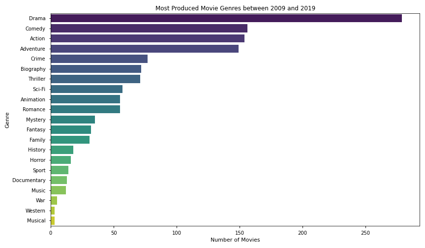
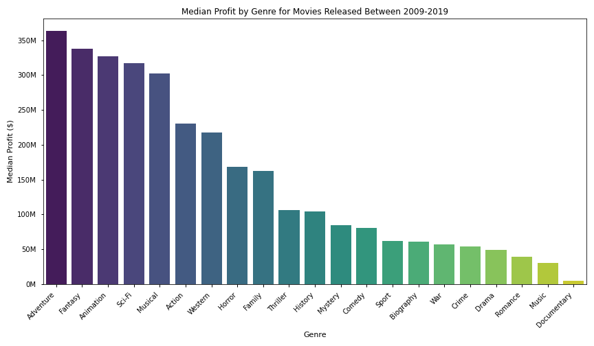
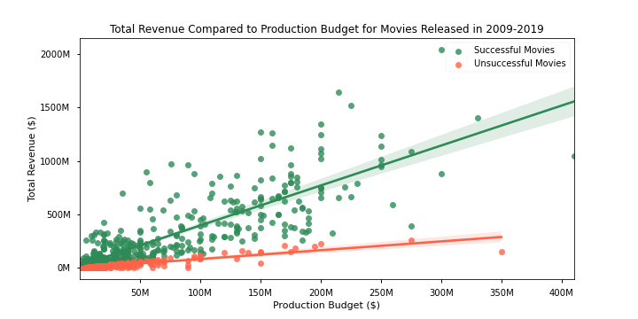
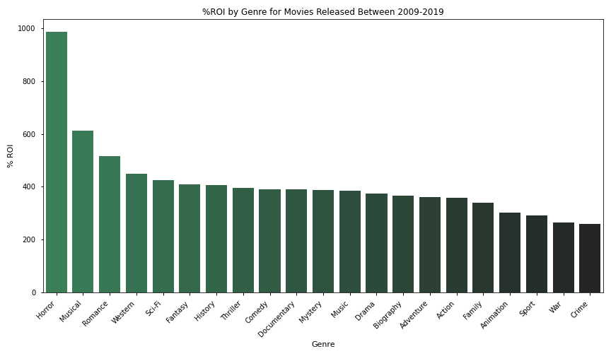

# Microsoft Studios: A New Frontier

**Author:** E. Berke Tezcan
***

## Overview

Microsoft decided to create a new movie studio to compete with other companies in the space but they are not familiar with the movie industry or what kinds of movies they should be creating for their studio to be successful. We were given the task to explore box office data in order to help Microsoft conquer this new frontier with at least three actionable findings.

There are many different factors that go into making a movie "successful". One can argue that the most important metric for a successful movie is the financial return like revenue and profit. There would not be any business case if the movies did not make any money after all... However, we believe that the public reaction to the movie is almost as important as the financial data, especially for a new company entering this space. A movie may return a profit, but if the moviegoers do not like the actual production, this will jeopardize the future success of the studio by hurting their brand, even if the movies they are making may be better in the future. For sustained growth, we believe that providing high quality productions liked by the masses that are profitable is the way forward. Therefore, we set parameters on the data to make sure we were looking at the common traits of successful movies. For more information please refer to the Data Understanding & Preparation section.

Throughout the analysis we looked at the importance of what genre a movie is, how the production budget may affect the financial success and popularity of the movie, as well as whether there was an optimal time to release a movie to capitalize on.

## Data Understanding & Preparation

For our data analysis we explored data from the largest movie databases online. These were namely: Box Office Mojo, IMDb, TMDb, The Numbers (TN) and Rotten Tomatoes. In order to pick which datasets we were going to use, we had to perform an exploratory data analysis (EDA) first. Our EDA began with comparing and contrasting the datasets that were provided to ensure that we kept as many data points as possible after the datasets were filtered and merged. This analysis also allowed us to define one of the aforementioned success parameters for movies by showing us that the median movie rating was 6.5. In the end, our analysis used data from IMDb and TN only since this combination allowed for the highest sample size and the most complete dataframe.

According to Wikipedia, "for many movie investors the required rate of return for this 'risky' investment may be 25% or more." Similarly, allaboutindiefilmmaking.com states that the investor expectation may be 10-25% return on top of their initial investment. With all this in mind, we came up with the following metrics: A successful movie should return at least a 25% profit and should have a higher average rating than 6.5 based on the median average rating we observed in our datasets. 

One parameter that we had to also define was what date range we should filter our data by. From our research we found that in 2009, James Cameron's Avatar changed the movie industry setting the path for "modern-day" movies. The technologies they developed and used to make CGI elements look as realistic as possible ended up being adopted by many movies and defining the past decade of the movie industry. Keeping this in mind, and the fact that popular culture changes target audiences every year, we believe that the data from 2009-2019 is the most relevant for Microsoft's business case. Therefore we limited our analysis to the past decade (2009-2019) while keeping 2020 data points out of the equation since 2020 was an outlier year by any measure due to the COVID-19 pandemic.

## Data Modeling

A movie's success can be definitely affected by its genre, production budget and its release date. People often look at the genre of a movie before anything else and make a snap decision whether they would like to see it or not. Similarly, a movie's production budget will affect this decision-making process since some movie-goers may want to see movies with higher quality production, better directors and actors etc. compared to indie movies. Lastly, depending on the release month movie-goers may not be able to go to the movies as much due to having to be in school or having to care for their school-aged children during the school year. So for our analysis we decided to take a deeper dive into these three areas to see if there are clear trends that Microsoft may use strategically for their movie creation process.

### Question 1: How does release date affect a movie's success?


#### Release Month vs. Total Revenue

 

From this graph we can see that historically, the months of May and June were when the most revenue was generated amongst the successful movies. The black line in this graph represents the median revenue values while the boxplot gives an idea on the spread of the data.

#### Release Month vs. Total Profit
      


Similar to the previous graph that shows the release month vs. total revenue, this graph shows a similar trend that suggests the most profitable movies were the ones that were released in May followed closely by June.

#### Our Recommendation for Microsoft

Microsoft should strongly consider releasing their movies in the summer months-- preferably in May or if not possible, in June. As the school year comes to an end, these months allow for more movie-goers to enjoy the movies in their local theater and this directly translates into maximizing revenue and profit.

### Question 2: How does the genre of the movie affect its success?

#### Most Produced Movie Genres
   

  

As seen above, Drama was by far the most produced genre between 2009 and 2019 followed by Comedy, Action and Adventure.

#### Genre vs. Median Revenue
   

    
Even though our analysis shows that Drama was the highest produced genre in the past decade, this graph shows us that Drama is not the optimal choice for generating revenue. Here we see that Adventure, Fantasy, Sci-Fi and Animation movies tend to generate more revenue compared to the other genres. 

#### Genre vs. Median Profit
    

    

Similar to the relationship between genre and revenue, we see that the most profitable genres are Adventure, Fantasy, Animation and Sci-Fi even though they are not the ones most produced.

#### Our Recommendation for Microsoft

As we saw in the past decade, even though Drama was the most produced genre, followed by Comedy, the most profitable and high grossing movies tended to be Adventure, Fantasy, Animation and Sci-Fi movies. This presents a great opportunity for Microsoft. By focusing on these four key genres and incorporating them into their movies, Microsoft can make a great entry into the movie industry, gain popularity and build their brand while also generating the financial returns that they desire.

### Question 3: How does the production budget affect a movie's ratings and financial success?


#### Production Budget vs. Average Movie Rating
    

    

As can be seen from the graph above, the successful movies as we defined them (higher than 25% profit and higher than a 6.5 rating) don't show a clear correlation between the production budget and the movie ratings while unsuccessful movies show a relatively higher correlation, but an overall weak one at that. This relationship debunks the assumption that, as more money is spent on the movie, the more it will be liked by cinema fans. The relationship shown suggests that a movie studio does not need to have a high production budget for it to have higher movie ratings.

#### Production Budget vs. Total Revenue

   

As seen above, the production budget has more of a direct effect on the revenue generated by the movie. This may be due to factors such as having increased marketing budgets, or being able to show the movie in more countries compared to a lower budget production. The difference between the successful and unsuccessful movies in this relationship is also noteworthy. Even with lower quality productions, the revenue tends to increase with the budget but is ultimately stifled potentially due to the overall quality of the production.

#### Production Budget vs. Total Profit
    


The analysis between total profit and production budget shows a positive correlation for successful movies. As the production budget increases, the total profit amount tends to increase as well. For unsuccessful movies though the story is a little different. As the production budget increases, total profit tends to stay flat or even decrease. This is potentially due to the relationship we explored above between total revenue and production budget. Since the revenue numbers are stifled for unsuccessful movies, the higher the budget gets, the harder it is to turn a profit or even breakeven.

#### Our Recommendation for Microsoft

Our analysis showed that, ultimately, production budget affects revenue and profits pretty strongly while the movie ratings by the general public tend to not change with higher budgets. Microsoft should strategically think about the production budget and decide between the riskier approach or the safer approach. If they are okay with taking a riskier approach, then higher production budgets may return stronger numbers; however, if the movie is not successful, the overall production may lose more money.
Either way, we found that having higher budgets doesn't translate into moviegoers liking the movies more. Therefore, our recommendation would be for Microsoft to build their fanbase prior to producing movies with higher budgets since it is absolutely possible to produce quality movies with lower budgets as can be seen. This will allow for Microsoft Studios to be financially successful and will pave the path for a sustained growth and success.

## Conclusions

Even though the movie industry is a new frontier for Microsoft, it is an exciting industry filled with opportunities. To sum up, our analysis showed the following:

- Movies released in May and June historically performed better compared to other months in terms of revenue and profits.
- Even though the most produced genre for the past decade was Drama, most revenue and profit was generated by Adventure movies followed closely by Fantasy, Animation and Sci-Fi.
- The best genre in terms of % ROI was Horror.
- Higher production budgets don't translate into the public liking those movies more.
- Higher production budgets generated more revenue and profit for successful movies but unsuccessful movies with higher budgets ended up losing more money overall.

Given more time and information about what kinds of movies Microsoft would like to make, we would have wanted to analyze how much the actors, writers and directors affect the success of the movies and what the optimal cast would look like. It would also be fruitful to analyze the data by generations so that Microsoft's marketing team can optimize their efforts for specific generations depending on the target audience of their movies. Furthermore, analyzing the unsuccessful movies in more depth to find common traits among them for Microsoft to *avoid* would lower the financial risks associated with this industry. Lastly, we would collect more data to improve on the accuracy of these findings.

## For More Information
Please review my full analysis in my <a href= 'https://github.com/ebtezcan/dsc-phase-1-project/blob/master/final_notebook.ipynb'>Jupyter Notebook </a>or <a href= 'https://github.com/ebtezcan/dsc-phase-1-project/blob/master/presentation.pdf'> my presentation </a>. For any additional questions, please contact Berke Tezcan at berketezcan@gmail.com.

### Repository Structure
```
├── README.md            <- The top-level README for reviewers of this project
├── final_notebook.ipynb <- Narrative documentation of analysis in Jupyter nb
├── notebook.pdf         <- Narrative documentation of analysis in PDF
├── presentation.pdf     <- PDF version of project presentation
├── zippedData           <- Externally sourced data
└── images               <- Both sourced externally and generated from code
```

## Appendix A - The relationship between Genre and % ROI

#### Genre vs. % ROI
   


If Microsoft's financial targets are more aligned with return on investment (% ROI) rather than pure revenue or profits, then we recommend they produce Horror movies instead. Our analysis showed that Horror had a higher ROI percentage compared to any other genre as can be seen above. This means that a higher return can be achieved compared to what is spent on the production budget.

## Appendix B - The relationship between Production Budget and % Profit

#### Production Budget vs. Profit %
    


The relationship between % profit and production budget is an interesting one. It seems like as production budget increases the % profit decreases. This is potentially due to the movie having to perform even better than lower costing successful movies to offset the high amount of costs associated with the production. This insight can be valuable for Microsoft if their earnings are reported in terms of % profit to shareholders rather than total values.